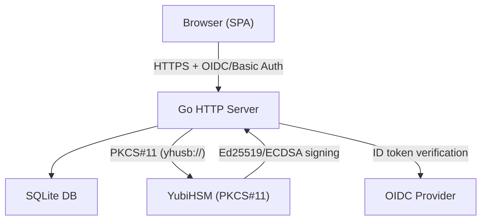
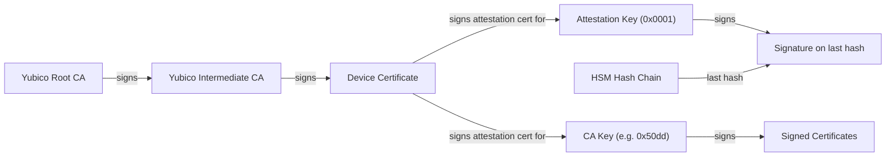
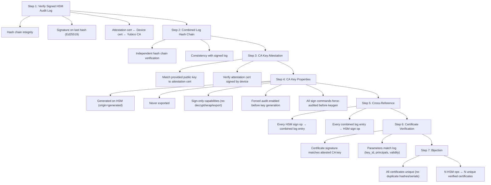
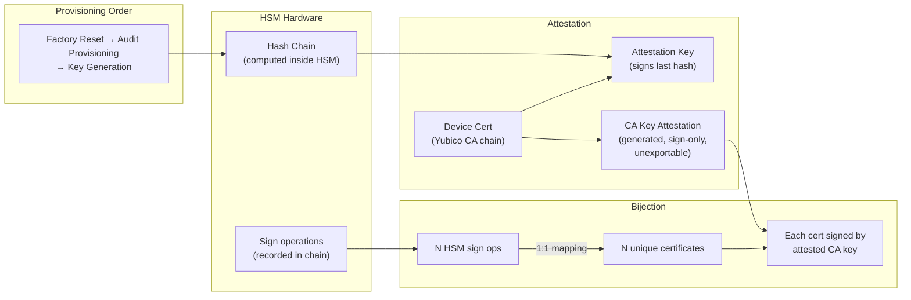

# Secsy PKI

HSM-backed SSH Certificate Authority with OIDC authentication, publicly auditable signing logs, and a web UI.

Secsy PKI manages an SSH public key infrastructure where CA private keys are stored on hardware security modules (HSMs) via PKCS#11. Users authenticate through OpenID Connect and request SSH certificates signed by the HSM. Every signing operation is recorded in a cryptographically verifiable audit log backed by the YubiHSM's hardware hash chain.

## Features

- **HSM-backed signing** — CA private keys live on a YubiHSM (or any PKCS#11 device). Keys never leave the hardware.
- **Ed25519 and ECDSA** — Generate and sign with Ed25519 (YubiHSM) or ECDSA P-256/P-384/P-521 (SoftHSM/YubiHSM).
- **Publicly auditable logs** — Every HSM signing operation is recorded in a hardware hash chain, signed by the device's attestation key, and cross-referenced with certificate parameters. An offline verifier (`secsy-verify`) proves the complete chain of trust.
- **Certificate uniqueness** — Each certificate is stored as raw binary with a SHA-256 uniqueness constraint per CA. Duplicate signing of the same material returns the existing certificate without calling the HSM.
- **OIDC authentication** — Public client with PKCE. The issuer discovery URL is the root of trust; no client secret needed.
- **Root user** — Configurable admin with basic auth, exempt from OIDC.
- **Permission matrix** — `SIGN_CERTIFICATE`, `MANAGE_PERMISSIONS`, and `CONFIGURE_CA` per CA node, assignable to users or groups.
- **Restriction sets** — Enforce policies on signing: max validity, allowed principals/cert types, forced email+reason key IDs, deny extensions/critical options.
- **Client-side key generation** — SSH keys are generated in the browser using the Web Crypto API. Private keys never leave the user's device.
- **HSM management** — Factory reset, audit provisioning, device info, and attestation certificate export from the UI.
- **Web UI** — Bootstrap 5 SPA with dark theme and SRI-pinned CDN resources.
- **SQLite backend** — Stores everything in canonical binary form (wire-format bytes for keys and certificates).
- **Terraform provisioning** — Provision the root CA key on a YubiHSM using [terraform-provider-pkcs11](https://github.com/blechschmidt/terraform-provider-pkcs11).

## Architecture



## Audit Verification

Secsy PKI provides cryptographic proof that a CA key has only signed the certificates listed in the audit log. The verification relies on three independent mechanisms that together form a complete chain of trust.

### Chain of Trust



### Verification Steps (`secsy-verify verify-combined-log`)



### Why This Works



The verification proves a strict provisioning order from the audit log:

1. **Factory reset** — device init entry (0xff) at entry 1 proves a clean slate
2. **Audit provisioning** — SET OPTION entries enable forced, irreversible logging for all sign commands, key generation, and wrapping operations
3. **Key generation** — GENERATE ASYMMETRIC KEY entry appears AFTER all audit provisioning entries
4. **Sign-only capabilities** — the CA key's attestation cert shows only signing capabilities (no decrypt, derive, wrap, or export)

Forced audit mode (irreversible) ensures the HSM refuses operations when the 62-entry log is full, preventing unlogged signing. The server consumes HSM audit entries before and after every HSM operation to keep the log from filling up.

### Usage

Build the verifier:
```bash
cd server
go build -o secsy-verify ./cmd/verify
```

Verify a signed audit log:
```bash
secsy-verify verify-audit-log \
  --audit-log signed-audit-log.json \
  --yubico-ca yubico-root.pem \
  --yubico-intermediate yubico-intermediate.pem
```

Verify the complete chain including certificate parameters:
```bash
secsy-verify verify-combined-log \
  --signed-log signed-audit-log.json \
  --combined-log combined-audit-log.json \
  --ca-key ca-public-key.pub \
  --yubico-ca yubico-root.pem \
  --yubico-intermediate yubico-intermediate.pem
```

The Yubico CA certificates can be downloaded from:
- Root: https://developers.yubico.com/YubiHSM2/Concepts/yubihsm2-attest-ca-crt.pem
- Intermediate: https://developers.yubico.com/YubiHSM2/Concepts/E45DA5F361B091B30D8F2C6FA040DB6FEF57918E.pem

## Quick Start

### Prerequisites

- Go 1.21+
- A PKCS#11 device (YubiHSM2 recommended) or SoftHSM for development
- Docker (for KeyCloak and integration tests)

### 1. Build

```bash
cd server
go build -o secsy-pki-server ./cmd/server
go build -o secsy-verify ./cmd/verify
```

### 2. Generate TLS Certificates

```bash
mkdir -p certs
openssl req -x509 -newkey ec -pkeyopt ec_paramgen_curve:prime256v1 \
  -keyout certs/server.key -out certs/server.crt -days 365 -nodes \
  -subj "/CN=localhost" -addext "subjectAltName=DNS:localhost,IP:127.0.0.1"
```

### 3. Configure

Edit `config.yaml`:

```yaml
server:
  host: "0.0.0.0"
  port: 8443
  tls_cert: "certs/server.crt"
  tls_key: "certs/server.key"

database:
  driver: "sqlite"
  dsn: "secsy-pki.db"

oidc:
  issuer_url: "http://localhost:8080/realms/secsy-pki"
  client_id: "secsy-pki"

root_user:
  username: "root"
  password: "change-me-in-production"

pkcs11:
  module_path: "/usr/lib/pkcs11/yubihsm_pkcs11.so"
  pin: "0001password"
  token_label: "YubiHSM"

yubihsm:
  connector_url: "yhusb://"
  auth_key_id: 1
  password: "password"
  suppress_audit_warning: false
```

For SoftHSM development, use `module_path: "/usr/lib/pkcs11/libsofthsm2.so"`.

### 4. Run

```bash
export YUBIHSM_PKCS11_CONF=/path/to/yubihsm_pkcs11.conf  # if using YubiHSM
./secsy-pki-server -config config.yaml
```

Open https://localhost:8443 and log in as `root`.

## Terraform

Provision the root CA key on a YubiHSM:

```bash
cd terraform
cp terraform.tfvars.example terraform.tfvars  # edit as needed
terraform init
terraform apply
```

The Ed25519 root key is generated on the YubiHSM via `yubihsm-shell` and imported into Terraform state:

```bash
terraform import 'pkcs11_key_pair.root_ca_ed25519[0]' 'key-label/key-id-hex'
```

### YubiHSM PKCS#11 Configuration

`yubihsm_pkcs11.conf`:
```
# Direct USB (no connector daemon needed)
connector = yhusb://
```

## API

All endpoints under `/api/` require authentication (Bearer token or Basic auth for root).

| Method | Path | Description |
|--------|------|-------------|
| GET | `/api/health` | Health check |
| GET | `/api/auth/config` | OIDC discovery config |
| GET | `/api/me` | Current user info |
| GET | `/api/cas` | List CAs |
| POST | `/api/cas` | Create CA (omit `pkcs11_uri` to generate key on HSM) |
| GET | `/api/cas/{id}` | Get CA |
| DELETE | `/api/cas/{id}` | Delete CA |
| POST | `/api/cas/{id}/sign` | Sign an SSH certificate (returns existing if already signed) |
| GET | `/api/cas/{id}/my-restrictions` | Get effective restriction set for current user |
| GET | `/api/groups` | List groups |
| POST | `/api/groups` | Create group |
| DELETE | `/api/groups/{id}` | Delete group |
| GET | `/api/groups/{id}/members` | List group members |
| POST | `/api/groups/{id}/members` | Add member |
| DELETE | `/api/groups/{id}/members/{sub}` | Remove member |
| GET | `/api/cas/{id}/permissions` | List permissions |
| POST | `/api/cas/{id}/permissions` | Grant permission (with optional restriction set) |
| DELETE | `/api/cas/{id}/permissions` | Revoke permission |
| GET | `/api/cas/{id}/restriction-sets` | List restriction sets for a CA |
| POST | `/api/cas/{id}/restriction-sets` | Create restriction set (requires CONFIGURE_CA) |
| PUT | `/api/restriction-sets/{id}` | Update restriction set |
| DELETE | `/api/restriction-sets/{id}` | Delete restriction set |
| PUT | `/api/cas/{id}/default-restriction-set` | Set CA default restriction set |
| GET | `/api/audit-log` | Sign operations audit log (filterable, paginated) |
| GET | `/api/access-log` | API access log (paginated) |
| GET | `/api/hsm/info` | HSM device info and audit status |
| GET | `/api/hsm/attestation` | Export device attestation certificate (PEM) |
| GET | `/api/hsm/audit-log` | HSM audit log entries from database |
| GET | `/api/hsm/signed-audit-log` | Signed HSM audit log (signature over last hash) |
| GET | `/api/hsm/combined-audit-log` | Combined log with sign operations and key attestations |
| POST | `/api/hsm/provision-audit` | Enable forced audit logging (irreversible) |
| POST | `/api/hsm/factory-reset` | Factory reset the YubiHSM |

### Sign a Certificate

```bash
curl -sk -u root:password -X POST https://localhost:8443/api/cas/{ca_id}/sign \
  -H 'Content-Type: application/json' \
  -d '{
    "public_key": "ssh-ed25519 AAAA... user@host",
    "cert_type": "user",
    "principals": ["username"],
    "valid_before": "+52w",
    "key_id": "user@org",
    "reason": "deployment"
  }'
```

If the same public key was already signed by this CA, the existing certificate is returned without calling the HSM.

## Integration Tests

Run with Docker (KeyCloak + OpenSSH):

```bash
cd server
./scripts/run-integration-tests.sh
```

## Test SSH Server

Validate certificate-based authentication:

```bash
cd test-ssh
docker build -t secsy-pki-test-sshd .
docker run -d -p 2222:22 secsy-pki-test-sshd

ssh -i id_test -o CertificateFile=id_test-cert.pub -p 2222 testuser@localhost
```

## Permissions

| Permission | Description |
|------------|-------------|
| `SIGN_CERTIFICATE` | Sign certificates through this CA (subject to restriction sets) |
| `MANAGE_PERMISSIONS` | Grant/revoke permissions and assign restriction sets |
| `CONFIGURE_CA` | Create/edit/delete restriction sets and set the CA default |

Permissions can be assigned to individual users (by OIDC subject) or to groups. The root user bypasses all permission checks.

## Restriction Sets

Restriction sets enforce policies on certificate signing. Priority: user-specific > group-specific > CA default.

| Field | Effect |
|-------|--------|
| `max_validity_secs` | Maximum certificate lifetime |
| `allowed_principals` | Only these principals (`*` for any) |
| `allowed_cert_types` | Only `user`, `host`, or both |
| `force_key_id_email_reason` | Key ID forced to `{email}: {reason}` |
| `deny_extensions` | No custom extensions allowed |
| `allowed_extensions` | Only these extensions (when not denied) |
| `deny_critical_options` | No critical options allowed |
| `max_valid_after_offset` | Max seconds into the future for valid-after |

## License

MIT
