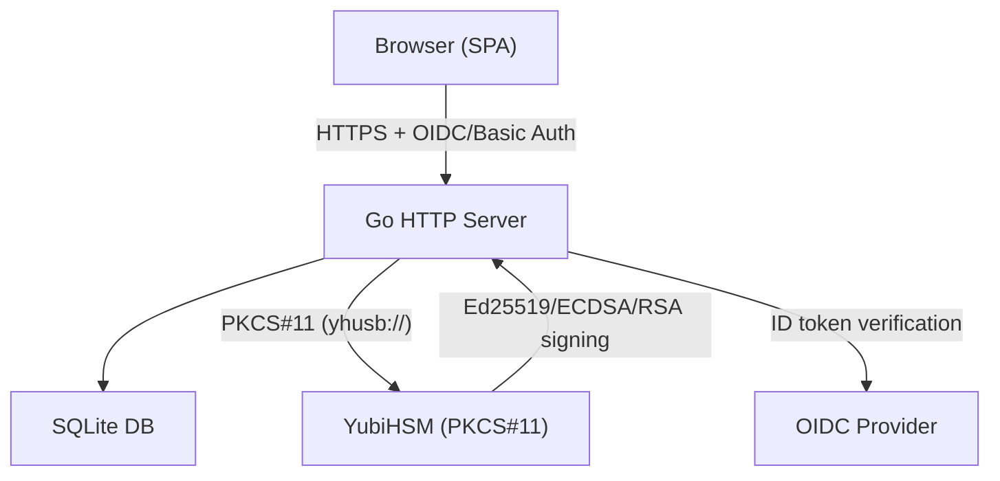
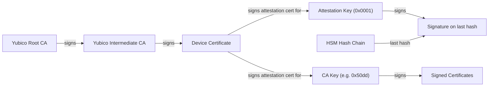
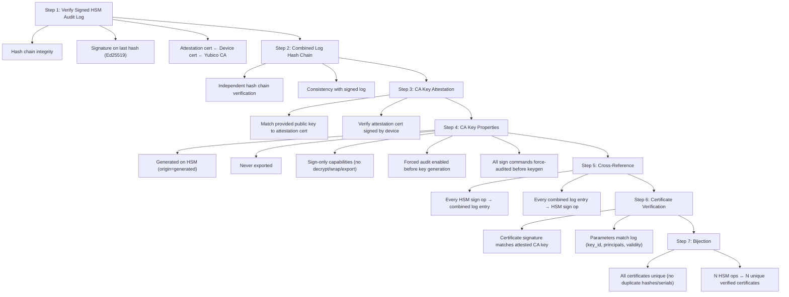
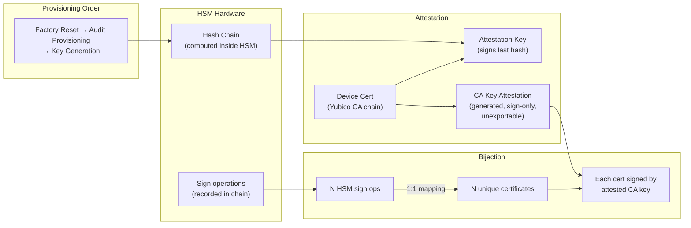
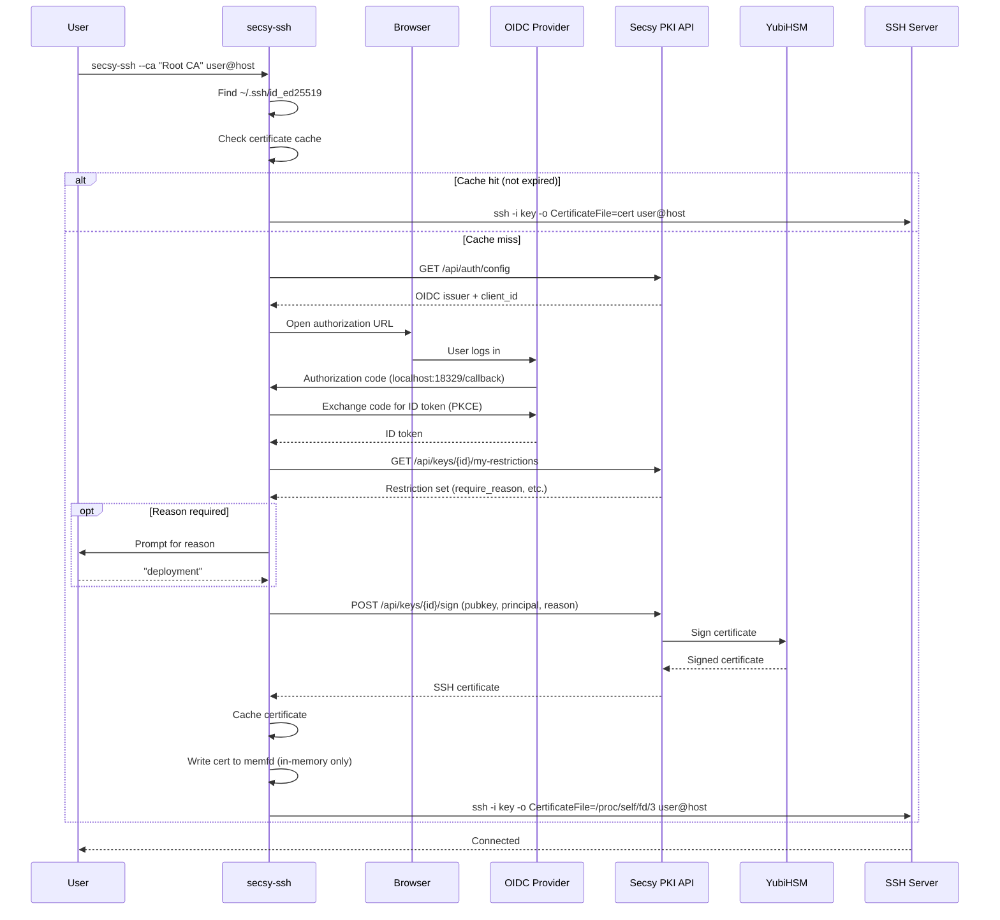

# Secsy PKI

HSM-backed SSH and X.509 Certificate Authority with OIDC authentication, publicly auditable signing logs, and a web UI.

Secsy PKI manages a public key infrastructure where CA private keys are stored on hardware security modules (HSMs) via PKCS#11. Users authenticate through OpenID Connect and request SSH or X.509 certificates signed by the HSM. Every signing operation is recorded in a cryptographically verifiable audit log backed by the YubiHSM's hardware hash chain.

## Enterprise Edition

The **enterprise edition** (this branch) extends the base CA into a full HSM-backed enterprise PKI and secret-management platform. On top of per-key SSH/X.509 signing it adds:

- **Backend-agnostic key provider** — one abstraction (`internal/keyprovider`) routes every key operation to a PKCS#11 HSM (YubiHSM, network HSM), SoftHSM for dev/CI, or an on-disk software keystore. Keys are generated on the device and never exported.
- **X.509 CA lifecycle** — bootstrap root and intermediate CAs, then issue, renew, and revoke end-entity certificates from CSRs using named profiles. All signing (leaves, CRLs, OCSP) happens on the HSM.
- **Revocation services** — signed CRLs (RFC 5280 CRL numbers) and a public OCSP responder.
- **HSM-backed secret encryption** — envelope-encrypt passwords and small secrets under an RSA KEK whose private half stays on the HSM.
- **RBAC** — organization-wide roles (`admin`, `issuer`, `auditor`) layered over the existing per-CA permission matrix.
- **Tamper-evident audit log** — an append-only, hash-chained event log recording who did what, when, and with what result — including denied attempts.
- **Centralized configuration** — RBAC assignments, issuance policy guardrails, and custom certificate profiles in one YAML file.

### Enterprise documentation

Comprehensive deployment and operations guides live in [`docs/`](docs/README.md):

| Guide | Topic |
|-------|-------|
| [HSM / PKCS#11 configuration](docs/hsm-configuration.md) | Key provider, HSM & SoftHSM setup |
| [Certificate authority](docs/certificate-authority.md) | CA setup, issuance, renewal, revocation, CRL & OCSP |
| [Password / secret encryption](docs/password-encryption.md) | HSM-backed envelope encryption |
| [RBAC, audit logging & config](docs/rbac-and-audit.md) | Roles, event log, centralized policy |
| [Production HSM migration](docs/hsm-migration.md) | SoftHSM → real HSM cutover |

The `secsy-ca` and `secsy-secret` CLIs drive the CA and secret features; see the guides above. The sections below document the base server, SSH workflow, and per-key signing API.

## Features

- **HSM-backed signing** — CA private keys live on a YubiHSM (or any PKCS#11 device). Keys never leave the hardware.
- **SSH and X.509 certificates** — Sign both OpenSSH certificates and X.509 certificates from CSRs using the same CA keys.
- **Ed25519, ECDSA, and RSA** — Generate and sign with Ed25519, ECDSA P-256/P-384/P-521, or RSA 2048/4096.
- **Publicly auditable logs** — Every HSM signing operation is recorded in a hardware hash chain, signed by the device's attestation key, and cross-referenced with certificate parameters. An offline verifier (`secsy-verify`) proves the complete chain of trust.
- **Certificate uniqueness** — Each certificate is stored as raw binary with a SHA-256 uniqueness constraint per CA. Duplicate signing of the same material returns the existing certificate without calling the HSM.
- **OIDC authentication** — Public client with PKCE. The issuer discovery URL is the root of trust; no client secret needed.
- **Root user** — Configurable admin with basic auth, exempt from OIDC.
- **Permission matrix** — `SIGN_CERTIFICATE`, `MANAGE_PERMISSIONS`, and `CONFIGURE_CA` per key, assignable to users or groups with separate SSH and X.509 restriction set overrides.
- **Restriction sets** — Separate SSH and X.509 restriction sets enforce policies on signing. SSH: max validity, allowed principals/cert types, forced email+reason key IDs, deny extensions/critical options. X.509: allowed key usages, ext key usages, SAN types/patterns, subject fields, deny CA. Built-in "Permit all" and "Disallow all" defaults for both types.
- **Public key export** — Export CA public keys in PEM (PKIX) or OpenSSH format via API and UI.
- **HSM management** — Factory reset, audit provisioning, device info, and attestation certificate export from the UI.
- **Web UI** — Bootstrap 5 SPA with dark theme and SRI-pinned CDN resources.
- **SQLite and PostgreSQL** — Dual database support. SQLite for development, PostgreSQL for production.
- **Terraform provisioning** — Provision the root CA key on a YubiHSM using [terraform-provider-pkcs11](https://github.com/blechschmidt/terraform-provider-pkcs11).

## Architecture



## Audit Verification

Secsy PKI provides cryptographic proof that a CA key has only signed the certificates listed in the audit log. The verification relies on three independent mechanisms that together form a complete chain of trust.

### Chain of Trust



### Verification Steps (`secsy-verify verify-combined-log`)



### Why This Works



The verification proves a strict provisioning order from the audit log:

1. **Factory reset** — device init entry (0xff) at entry 1 proves a clean slate
2. **Audit provisioning** — SET OPTION entries enable forced, irreversible logging for all sign commands, key generation, and wrapping operations
3. **Key generation** — GENERATE ASYMMETRIC KEY entry appears AFTER all audit provisioning entries
4. **Sign-only capabilities** — the CA key's attestation cert shows only signing capabilities (no decrypt, derive, wrap, or export)

Forced audit mode (irreversible) ensures the HSM refuses operations when the 62-entry log is full, preventing unlogged signing. The server consumes HSM audit entries before and after every HSM operation to keep the log from filling up.

### Usage

Build the verifier:
```bash
cd server
go build -o secsy-verify ./cmd/verify
```

Verify a signed audit log:
```bash
secsy-verify verify-audit-log \
  --audit-log signed-audit-log.json \
  --yubico-ca yubico-root.pem \
  --yubico-intermediate yubico-intermediate.pem
```

Verify the complete chain including certificate parameters:
```bash
secsy-verify verify-combined-log \
  --signed-log signed-audit-log.json \
  --combined-log combined-audit-log.json \
  --ca-key ca-public-key.pub \
  --yubico-ca yubico-root.pem \
  --yubico-intermediate yubico-intermediate.pem
```

The Yubico CA certificates can be downloaded from:
- Root: https://developers.yubico.com/YubiHSM2/Concepts/yubihsm2-attest-ca-crt.pem
- Intermediate: https://developers.yubico.com/YubiHSM2/Concepts/E45DA5F361B091B30D8F2C6FA040DB6FEF57918E.pem

## Quick Start

### Prerequisites

- Go 1.25+
- A PKCS#11 device (YubiHSM2 recommended) or SoftHSM for development
- Docker (for KeyCloak and integration tests)

### 1. Build

```bash
cd server

# With SQLite support
go build -tags sqlite -o secsy-pki-server ./cmd/server

# Without SQLite (PostgreSQL only)
go build -o secsy-pki-server ./cmd/server

# Tools
go build -o secsy-verify ./cmd/verify
go build -o secsy-ssh ./cmd/secsy-ssh
```

### 2. Generate TLS Certificates

```bash
mkdir -p certs
openssl req -x509 -newkey ec -pkeyopt ec_paramgen_curve:prime256v1 \
  -keyout certs/server.key -out certs/server.crt -days 365 -nodes \
  -subj "/CN=localhost" -addext "subjectAltName=DNS:localhost,IP:127.0.0.1"
```

### 3. Configure

Edit `config.yaml`:

```yaml
server:
  host: "0.0.0.0"
  port: 8443
  tls_cert: "certs/server.crt"
  tls_key: "certs/server.key"

database:
  driver: "sqlite"
  dsn: "secsy-pki.db"

oidc:
  issuer_url: "http://localhost:8080/realms/secsy-pki"
  client_id: "secsy-pki"

root_user:
  username: "root"
  password: "change-me-in-production"

pkcs11:
  module_path: "/usr/lib/pkcs11/yubihsm_pkcs11.so"
  pin: "0001password"
  token_label: "YubiHSM"
  token_serial: ""       # optional: match by serial number
  token_manufacturer: "" # optional: match by manufacturer

yubihsm:
  connector_url: "yhusb://"
  auth_key_id: 1
  password: "password"
  suppress_audit_warning: false
```

For SoftHSM development, use `module_path: "/usr/lib/softhsm/libsofthsm2.so"`. Run `./scripts/setup-softhsm.sh` to initialize a token, and `eval "$(./scripts/setup-softhsm.sh --export-env)"` to wire the `SECSY_*` environment variables. See [HSM / PKCS#11 configuration](docs/hsm-configuration.md).

The enterprise blocks — `key_provider`, `rbac`, `policy`, `profiles`, and `secret` — are documented in [`docs/`](docs/README.md) and shown fully commented in [`server/config.yaml`](server/config.yaml).

For PostgreSQL, change the database section:
```yaml
database:
  driver: "postgres"
  dsn: "host=localhost user=secsy password=secret dbname=secsypki sslmode=disable"
```

### 4. Run

```bash
./secsy-pki-server -config config.yaml
```

The server auto-generates `yubihsm_pkcs11.conf` from the `yubihsm.connector_url` config setting. You can also set `YUBIHSM_PKCS11_CONF` manually if needed.

Open https://localhost:8443 and log in as `root`.

## secsy-ssh: SSH Client Wrapper

`secsy-ssh` wraps the standard `ssh` command with automatic OIDC-based certificate authentication. It handles the entire flow: OIDC login via browser, certificate signing through the Secsy PKI API, and passing the certificate to `ssh` — all in a single command.

### How It Works



### Install

```bash
cd server
go build -o secsy-ssh ./cmd/secsy-ssh
sudo cp secsy-ssh /usr/local/bin/
```

### Configure

Create `~/.ssh/secsy.yaml`:

```yaml
api_url: "https://secsy-pki.example.com:8443"
# insecure_skip_verify: true  # only for development with self-signed certs
```

### Usage

```bash
# Basic usage — opens browser for OIDC login, signs key, connects
secsy-ssh --ca "Root CA" user@host

# With a specific port
secsy-ssh --ca "Root CA" user@host -p 2222

# Provide a reason (if the CA requires it)
secsy-ssh --ca "Root CA" --reason "deployment" user@host

# Skip the certificate cache
secsy-ssh --ca "Root CA" --nocache user@host

# All standard ssh options work
secsy-ssh --ca "Root CA" user@host -L 8080:localhost:80 -N
```

### Options

| Flag | Description |
|------|-------------|
| `--ca <name>` | CA to sign with (required, matched by label or ID) |
| `--reason <text>` | Reason for the certificate (prompted interactively if CA requires it) |
| `--nocache` | Skip the certificate cache, always request a new one |

All other arguments are passed directly to `ssh`.

### Key Discovery

`secsy-ssh` searches `~/.ssh/` for the first available key with a corresponding `.pub` file. Preferred order:

1. `id_ed25519`
2. `id_ecdsa`
3. `id_rsa`
4. Any other `id_*` file (e.g., `id_ed25519_work`, `id_ecdsa_deploy`)

The corresponding `.pub` file is sent to the API for signing.

### Certificate Caching

Signed certificates are cached in `$XDG_RUNTIME_DIR/secsy-ssh/` (or `/tmp/secsy-ssh-<uid>/` if `XDG_RUNTIME_DIR` is not set). The cache key is a SHA-256 hash of all CLI arguments.

- Cached certificates are reused until they expire (checked by parsing the certificate's `ValidBefore` field)
- Use `--nocache` to bypass the cache
- Different arguments (host, port, CA, reason) produce different cache keys

### Security Properties

- **No disk writes**: The signed certificate is held in memory using `memfd_create(2)` and passed to `ssh` via `/proc/self/fd/3`. No certificate data touches the filesystem (except the cache, which uses `0600` permissions in the runtime directory).
- **PKCE**: The OIDC flow uses Proof Key for Code Exchange (S256) with a local callback server on port 18329.
- **Principal extraction**: The SSH username (from `user@host` or `-l user`) is automatically included as the certificate principal.
- **Restriction enforcement**: If the CA has a restriction set with `require_reason`, the user is prompted interactively. If `force_key_id_email` is set, the key ID is automatically set to the user's email from the OIDC token.

### OIDC Provider Setup

The OIDC provider must be configured to allow the redirect URI `http://localhost:18329/*` for the `secsy-ssh` callback. For KeyCloak:

```bash
# Add redirect URI via admin API
curl -X PUT -H "Authorization: Bearer $ADMIN_TOKEN" \
  "http://keycloak:8080/admin/realms/secsy-pki/clients/$CLIENT_UUID" \
  -H "Content-Type: application/json" \
  -d '{"redirectUris": ["https://your-server:8443/*", "http://localhost:18329/*"]}'
```

### Example: Full Setup

```bash
# 1. Configure
cat > ~/.ssh/secsy.yaml << 'EOF'
api_url: "https://secsy-pki.example.com:8443"
EOF

# 2. Generate an SSH key (if you don't have one)
ssh-keygen -t ed25519

# 3. Connect — browser opens for login, cert is signed, SSH connects
secsy-ssh --ca "Production CA" deploy@server.example.com

# 4. Second connection — uses cached cert, no browser needed
secsy-ssh --ca "Production CA" deploy@server.example.com
```

## Terraform

Provision the root CA key on a YubiHSM:

```bash
cd terraform
cp terraform.tfvars.example terraform.tfvars  # edit as needed
terraform init
terraform apply
```

The Ed25519 root key is generated on the YubiHSM via `yubihsm-shell` and imported into Terraform state:

```bash
terraform import 'pkcs11_key_pair.root_ca_ed25519[0]' 'key-label/key-id-hex'
```

### YubiHSM PKCS#11 Configuration

`yubihsm_pkcs11.conf`:
```
# Direct USB (no connector daemon needed)
connector = yhusb://
```

## API

All endpoints under `/api/` require authentication (Bearer token or Basic auth for root).

| Method | Path | Description |
|--------|------|-------------|
| GET | `/api/health` | Health check |
| GET | `/api/auth/config` | OIDC discovery config |
| GET | `/api/me` | Current user info |
| GET | `/api/keys` | List keys |
| POST | `/api/keys` | Create key (omit `pkcs11_uri` to generate on HSM) |
| GET | `/api/keys/{id}` | Get key |
| DELETE | `/api/keys/{id}` | Delete key |
| GET | `/api/keys/{id}/public-key` | Export public key (`?format=pem` default, `?format=ssh`) |
| POST | `/api/keys/{id}/sign` | Sign an SSH certificate |
| POST | `/api/keys/{id}/sign-x509` | Sign an X.509 certificate from CSR |
| POST | `/api/parse-csr` | Parse and display CSR contents |
| GET | `/api/keys/{id}/my-restrictions` | Get effective restriction set (`?format=ssh\|x509`) |
| GET | `/api/groups` | List groups |
| POST | `/api/groups` | Create group |
| DELETE | `/api/groups/{id}` | Delete group |
| GET | `/api/groups/{id}/members` | List group members |
| POST | `/api/groups/{id}/members` | Add member |
| DELETE | `/api/groups/{id}/members/{sub}` | Remove member |
| GET | `/api/keys/{id}/permissions` | List permissions |
| POST | `/api/keys/{id}/permissions` | Grant permission (with SSH/X.509 restriction sets) |
| DELETE | `/api/keys/{id}/permissions` | Revoke permission |
| GET | `/api/restriction-sets` | List all restriction sets |
| POST | `/api/restriction-sets` | Create global restriction set |
| GET | `/api/keys/{id}/restriction-sets` | List restriction sets for a key (includes global) |
| POST | `/api/keys/{id}/restriction-sets` | Create key-specific restriction set |
| PUT | `/api/restriction-sets/{id}` | Update restriction set |
| DELETE | `/api/restriction-sets/{id}` | Delete restriction set |
| PUT | `/api/keys/{id}/default-restriction-set` | Set key default (`type`: `ssh`\|`x509`) |
| GET | `/api/audit-log` | Sign operations audit log (filterable, paginated) |
| GET | `/api/access-log` | API access log (paginated) |
| GET | `/api/hsm/info` | HSM device info and audit status |
| GET | `/api/hsm/attestation` | Export device attestation certificate (PEM) |
| GET | `/api/hsm/audit-log` | HSM audit log entries from database |
| GET | `/api/hsm/signed-audit-log` | Signed HSM audit log (signature over last hash) |
| GET | `/api/hsm/combined-audit-log` | Combined log with sign operations and key attestations |
| POST | `/api/hsm/provision-audit` | Enable forced audit logging (irreversible) |
| POST | `/api/hsm/factory-reset` | Factory reset the YubiHSM |

### Sign an SSH Certificate

```bash
curl -sk -u root:password -X POST https://localhost:8443/api/keys/{key_id}/sign \
  -H 'Content-Type: application/json' \
  -d '{
    "public_key": "ssh-ed25519 AAAA... user@host",
    "cert_type": "user",
    "principals": ["username"],
    "valid_before": "+52w",
    "key_id": "user@org",
    "reason": "deployment"
  }'
```

### Sign an X.509 Certificate

```bash
curl -sk -u root:password -X POST https://localhost:8443/api/keys/{key_id}/sign-x509 \
  -H 'Content-Type: application/json' \
  -d '{
    "csr": "-----BEGIN CERTIFICATE REQUEST-----\n...\n-----END CERTIFICATE REQUEST-----",
    "valid_before": "+365d"
  }'
```

All certificate parameters (subject, SANs, extensions) are taken from the CSR.

## Testing

### Unit Tests

```bash
cd server
go test -tags sqlite ./internal/...
```

### Unit Tests with YubiHSM Hardware

When a YubiHSM is connected, additional tests cover PKCS#11 signing and HSM operations:

```bash
go test -tags "sqlite yubihsm" ./internal/...
```

These tests are automatically skipped in CI (which uses SoftHSM instead).

### Integration Tests

Run with Docker (KeyCloak + OpenSSH):

```bash
cd server
./scripts/run-integration-tests.sh
```

## Test SSH Server

Validate certificate-based authentication:

```bash
cd test-ssh
docker build -t secsy-pki-test-sshd .
docker run -d -p 2222:22 secsy-pki-test-sshd

ssh -i id_test -o CertificateFile=id_test-cert.pub -p 2222 testuser@localhost
```

## Permissions

| Permission | Description |
|------------|-------------|
| `SIGN_CERTIFICATE` | Sign certificates through this CA (subject to restriction sets) |
| `MANAGE_PERMISSIONS` | Grant/revoke permissions and assign restriction sets |
| `CONFIGURE_CA` | Create/edit/delete restriction sets and set the CA default |

Permissions can be assigned to individual users (by OIDC subject) or to groups. The root user bypasses all permission checks.

## Restriction Sets

Restriction sets enforce policies on certificate signing. SSH and X.509 restriction sets are separate types stored in dedicated database tables. Priority: user-specific > group-specific > key default.

Each key has separate default SSH and X.509 restriction sets. New keys default to "Disallow all signatures" for both types. Built-in restriction sets:
- **Permit all signatures** — no restrictions
- **Disallow all signatures** — blocks all signing (`deny_all: true`)

Restriction sets can be global (not associated with any key) or key-specific.

### SSH Restriction Set Fields

| Field | Effect |
|-------|--------|
| `max_validity_secs` | Maximum certificate lifetime |
| `deny_all` | Block all SSH signing |
| `allowed_principals` | Only these principals (`*` for any) |
| `allowed_cert_types` | Only `user`, `host`, or both |
| `force_key_id_email` | Key ID forced to user email |
| `require_reason` | User must provide a reason (appended to key ID as `email (reason)`) |
| `deny_extensions` | No custom extensions allowed |
| `allowed_extensions` | Only these extensions (when not denied) |
| `deny_critical_options` | No critical options allowed |
| `max_valid_after_offset` | Max seconds into the future for valid-after |

### X.509 Restriction Set Fields

| Field | Effect |
|-------|--------|
| `max_validity_secs` | Maximum certificate lifetime |
| `deny_all` | Block all X.509 signing |
| `allowed_key_usages` | Only these key usages (e.g. `digitalSignature`, `keyEncipherment`) |
| `allowed_ext_key_usages` | Only these extended key usages (e.g. `serverAuth`, `clientAuth`) |
| `allowed_san_types` | Only these SAN types (`dns`, `ip`, `email`) |
| `allowed_san_patterns` | Only SANs matching these patterns (e.g. `*.example.com`, `10.0.0.0/8`) |
| `allowed_subject_fields` | Only these subject fields (`CN`, `O`, `OU`, `C`, `ST`, `L`) |
| `max_path_length` | Maximum CA path length (`-1` = no CA certs) |
| `deny_ca` | Cannot issue CA certificates |

## License

MIT
